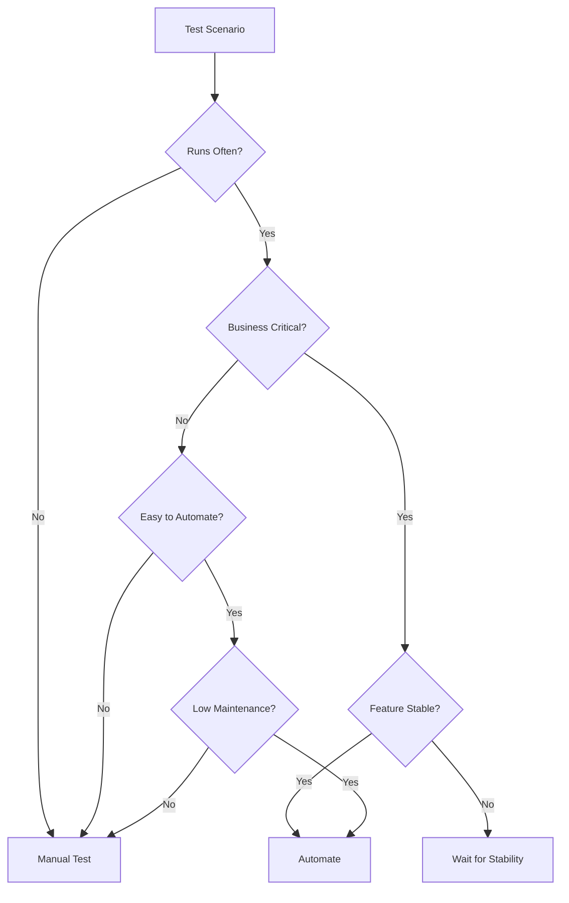

<figure>
  
  <figcaption></figcaption>
</figure>

## Introduction

Automation is one of the most powerful tools available to modern QA engineers. Done well, it accelerates feedback, reduces repetitive manual work, and protects critical functionality across every release.

However, **not every test should be automated**.

One of the most common mistakes teams make is attempting to automate too much, too early, or at the wrong layer of the system. The result is often brittle tests, slow pipelines, and growing maintenance costs.

This guide introduces a **practical framework QA engineers can use to decide what tests to automate**, along with a **decision tree and scoring model** that help teams prioritize automation efforts effectively.


## Why Choosing the Right Tests to Automate Matters

Automation requires ongoing investment. Every automated test introduces:

* Code that must be maintained
* Dependencies on environments and data
* Execution time in CI pipelines

When teams automate the wrong tests, they often experience:

* Flaky builds
* Fragile UI tests
* Slow feedback cycles
* High maintenance overhead

Strong automation strategies focus on **maximizing long-term value**, not maximizing test counts.

The goal is to automate tests that:

* Run frequently
* Protect critical user workflows
* Provide fast, reliable feedback
* Remain stable over time


## The QA Automation Decision Framework

Before automating a test, QA engineers should evaluate it across five key dimensions:

1. **Execution Frequency**
2. **Business Impact**
3. **Feature Stability**
4. **Test Determinism**
5. **Maintenance Cost**

Together, these factors help determine whether automation will provide a meaningful return on investment.


## Automation Decision Tree

The following decision tree helps QA teams quickly evaluate automation candidates.



### How to Use This Decision Tree

QA engineers can use this model during:

* Sprint planning
* Test case design
* Automation backlog grooming

If a test fails multiple decision points, it is usually better suited for **manual execution or exploratory testing**.


## Key Criteria for Automation Candidates

### 1. Execution Frequency

The more frequently a test runs, the greater the benefit of automation.

**Strong candidates include:**

* Regression tests
* Smoke tests
* CI pipeline validations
* API contract checks

Tests executed on **every build or deployment** typically deliver the highest automation ROI.


### 2. Business and User Impact

Automation should protect the most critical parts of the product.

Examples of **high-impact workflows**:

* Authentication and login
* Payment processing
* Account creation
* Data integrity operations
* Core product workflows

If these areas fail, the impact on users and the business can be significant.


### 3. Feature Stability

Automating unstable features often leads to brittle tests.

Avoid automation when:

* UI elements are frequently redesigned
* Requirements are still evolving
* Features are experimental

It is usually better to **wait until the feature stabilizes** before investing in automation.


### 4. Test Determinism

A strong automation candidate should produce **predictable results**.

Good automated tests are:

* Deterministic (same input produces same output)
* Scriptable
* Observable with clear pass/fail conditions

Tests that require **human interpretation or visual judgment** are typically poor candidates for automation.


### 5. Maintenance Cost

Every automated test must be maintained over time.

Tests that are expensive to maintain often include:

* Highly dynamic UI workflows
* Complex environment dependencies
* Multi-system integration setups

Automation should reduce effort—not create long-term maintenance burdens.


## Aligning Automation with the Test Pyramid

A strong QA automation strategy also respects the **test pyramid**.

```
        UI Tests
      (Few & Critical)

     Integration Tests
        (Moderate)

      Unit / API Tests
        (Many & Fast)
```

###Key principles:

* **Unit and API tests** should make up the majority of automation.
* **Integration tests** verify interactions between components.
* **UI tests** should focus on critical end-to-end workflows.

Over-reliance on UI automation often leads to **slow and fragile pipelines**.


## A Simple Automation Scoring Model

QA teams can also use a scoring model to evaluate potential automation candidates.

| Criterion        | Score 1             | Score 5             |
| ---------------- | ------------------- | ------------------- |
| Frequency        | Rarely executed     | Runs every build    |
| Business Impact  | Low impact          | Mission critical    |
| Stability        | Frequently changing | Very stable         |
| Determinism      | Hard to automate    | Fully deterministic |
| Maintenance Cost | High cost           | Low cost            |

### Interpreting the Score

| Score        | Recommendation              |
| ------------ | --------------------------- |
| **20–25**    | Automate immediately        |
| **14–19**    | Strong candidate            |
| **10–13**    | Consider partial automation |
| **Below 10** | Keep manual                 |

This method helps QA teams make **consistent and objective automation decisions**.


## Common Automation Mistakes QA Teams Make

### Automating Too Early

Automating unstable features leads to constant test failures and wasted effort.

### Automating Everything

Some tests are better suited for **manual or exploratory testing**.

### Ignoring Maintenance Costs

Automation that requires constant repair can become a liability.

### Overusing UI Automation

UI tests are valuable but should be **used sparingly and strategically**.


## Practical Starting Points for QA Engineers

If you're building or expanding an automation suite, start with:

* High-value regression tests
* Smoke tests in CI pipelines
* Critical user workflows
* API-level validations
* Stable, deterministic scenarios

These tests usually provide the **fastest return on automation investment**.


## Conclusion

Effective test automation is not about achieving 100% automation coverage. It is about **strategically selecting the tests that deliver the greatest long-term value**.

By evaluating test candidates based on:

* Execution frequency
* Business impact
* Feature stability
* Determinism
* Maintenance cost

QA engineers can build automation suites that are **reliable, scalable, and sustainable**.

Thoughtful automation leads to faster feedback, more confident releases, and stronger software quality.


## FAQ

### Should QA teams aim for 100% automation?

No. Some tests require human judgment or exploratory investigation and are better executed manually.

### When is UI automation appropriate?

UI automation is most valuable for **critical end-to-end workflows** that validate the full user experience.

### What tests should be automated first?

Start with:

* Regression tests
* Smoke tests
* High-risk workflows
* API-level validations

These typically deliver the fastest return.

### How often should automation suites be reviewed?

Automation suites should be reviewed regularly—ideally **every sprint**—to remove flaky tests, update outdated scenarios, and reassess priorities.
